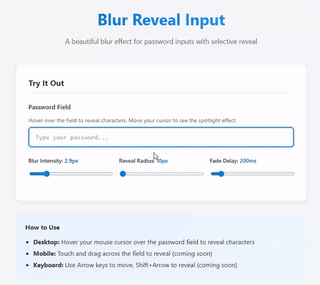

# blur-reveal-input

**Replace boring password dots with a beautiful blur effect.** Hover or touch to reveal.

Zero dependencies. Works everywhere — vanilla JS, React, Vue, Angular, Svelte, or a simple `<script>` tag.

[](https://www.npmjs.com/package/blur-reveal-input)
[](https://bundlephobia.com/package/blur-reveal-input)
[](https://github.com/iLoveMyCat/blur-reveal-input/blob/main/LICENSE)

**[Live Demo](https://ilovemycat.github.io/blur-reveal-input/)**



---

## What is this?

Standard password fields show `••••••••`. This library shows your password text behind a CSS blur — move your mouse or finger across to reveal it through a clear window. When you stop, it fades back to blurred.

- **Desktop**: Hover to reveal, characters stay visible as you move across, smooth fade-out when you leave
- **Mobile**: Touch and drag to reveal, fades back after lifting your finger
- **Accessible**: Respects `prefers-reduced-motion`, works with screen readers, supports high contrast mode

## Install

### npm / yarn / pnpm / bun

```bash
npm install blur-reveal-input
```

### CDN (no build step)

```html
<script src="https://unpkg.com/blur-reveal-input"></script>
```

or

```html
<script src="https://cdn.jsdelivr.net/npm/blur-reveal-input"></script>
```

That's it — all `<input type="password">` fields on the page are automatically enhanced.

## Usage

### Drop-in (CDN / script tag)

Just include the script. Every password input on the page gets the blur effect automatically:

```html
<input type="password" placeholder="Enter password">
<script src="https://unpkg.com/blur-reveal-input"></script>
```

Opt out a specific input:

```html
<input type="password" data-blur-reveal="false" placeholder="Normal password">
```

### ES Module (bundlers)

```js
import { BlurRevealInput } from 'blur-reveal-input';

const input = document.querySelector('input[type="password"]');
const blur = new BlurRevealInput(input);

// Later: clean up
blur.destroy();
```

### React

```jsx
import { useEffect, useRef } from 'react';
import { BlurRevealInput } from 'blur-reveal-input';

function PasswordField() {
  const inputRef = useRef(null);

  useEffect(() => {
    const blur = new BlurRevealInput(inputRef.current);
    return () => blur.destroy();
  }, []);

  return <input ref={inputRef} type="password" placeholder="Password" />;
}
```

### Vue

```vue
<template>
  <input ref="passwordInput" type="password" placeholder="Password" />
</template>

<script setup>
import { ref, onMounted, onBeforeUnmount } from 'vue';
import { BlurRevealInput } from 'blur-reveal-input';

const passwordInput = ref(null);
let blur;

onMounted(() => {
  blur = new BlurRevealInput(passwordInput.value);
});

onBeforeUnmount(() => {
  blur?.destroy();
});
</script>
```

### Angular

```typescript
import { Component, ElementRef, ViewChild, AfterViewInit, OnDestroy } from '@angular/core';
import { BlurRevealInput } from 'blur-reveal-input';

@Component({
  selector: 'app-password',
  template: `<input #passwordInput type="password" placeholder="Password" />`
})
export class PasswordComponent implements AfterViewInit, OnDestroy {
  @ViewChild('passwordInput') inputRef!: ElementRef<HTMLInputElement>;
  private blur?: BlurRevealInput;

  ngAfterViewInit() {
    this.blur = new BlurRevealInput(this.inputRef.nativeElement);
  }

  ngOnDestroy() {
    this.blur?.destroy();
  }
}
```

### Svelte

```svelte
<script>
  import { onMount } from 'svelte';
  import { BlurRevealInput } from 'blur-reveal-input';

  let inputEl;

  onMount(() => {
    const blur = new BlurRevealInput(inputEl);
    return () => blur.destroy();
  });
</script>

<input bind:this={inputEl} type="password" placeholder="Password" />
```

### WordPress

Install the [Blur Reveal Input plugin](examples/wordpress/) — upload the zip through **Plugins > Add New > Upload Plugin**, activate, and every password field on your site gets the blur effect automatically. Includes a settings page with live preview.

Or just enqueue the script in your theme's `functions.php`:

```php
function my_blur_reveal() {
    wp_enqueue_script(
        'blur-reveal-input',
        'https://unpkg.com/blur-reveal-input',
        array(),
        '1.0.0',
        true
    );
}
add_action( 'wp_enqueue_scripts', 'my_blur_reveal' );
```

### Shopify

Add to your `theme.liquid` before `</body>`:

```html
<script src="https://unpkg.com/blur-reveal-input"></script>
```

All password inputs in your store (login, registration, checkout) are automatically enhanced.

### Apply to all password inputs

```js
import { BlurRevealInput } from 'blur-reveal-input';

// Enhance every password input on the page
const instances = BlurRevealInput.applyToAll();

// Clean up all
instances.forEach(i => i.destroy());
```

## Configuration

```js
const blur = new BlurRevealInput(input, {
  blurIntensity: 4,    // Blur strength in px (default: 4)
  revealRadius: 30,    // Reveal window size in px (default: 30, mobile: 40)
  fadeDelay: 500,       // ms before fade-out starts (default: 500)
  fadeDuration: 300,    // ms for fade-out animation (default: 300)
  enabled: true,        // Enable/disable (default: true)
});

// Update at runtime
blur.updateConfig({ blurIntensity: 6, fadeDelay: 1000 });

// Toggle
blur.disable();
blur.enable();
```

### Data attributes (no JS needed with CDN)

```html
<input type="password"
  data-blur-intensity="6"
  data-reveal-radius="40"
  data-fade-delay="1000"
>
```

## Events

```js
input.addEventListener('blur-reveal:reveal', (e) => {
  console.log('Revealing at', e.detail.x, e.detail.y);
});

input.addEventListener('blur-reveal:hide', () => {
  console.log('Hidden');
});

input.addEventListener('blur-reveal:init', () => {
  console.log('Initialized');
});

input.addEventListener('blur-reveal:destroy', () => {
  console.log('Destroyed');
});
```

## CSS Custom Properties

Override these to customize the look:

```css
.blur-reveal-container {
  --blur-reveal-intensity: 4px;
  --blur-reveal-radius: 30px;
  --blur-reveal-font: 'Your Mono Font', monospace;
}
```

## Browser Support

Works in all modern browsers that support CSS `filter: blur()` and `mask-image`:

- Chrome 76+
- Firefox 53+
- Safari 15.4+
- Edge 79+
- iOS Safari 15.4+
- Chrome for Android 76+

## How it works

1. Wraps your `<input type="password">` in a container
2. Creates two overlays: one permanently blurred, one clear with a CSS mask
3. The input text is made transparent (caret stays visible)
4. On hover/touch, the clear overlay's mask follows your cursor, revealing text through the blur
5. When you leave, the clear overlay fades out smoothly using `requestAnimationFrame`

The actual password value never leaves the input element. This is purely a visual effect.

## Author

**Arik Shalito** — [GitHub](https://github.com/iLoveMyCat)

## License

[MIT](LICENSE)
